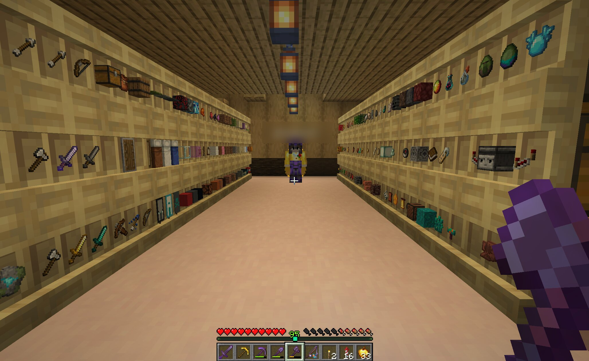
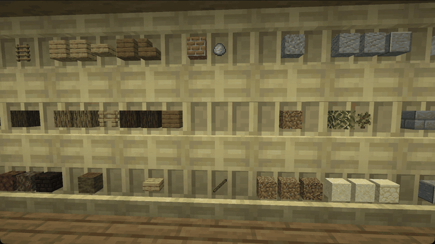

<p align="center">
  
</p>

<h1 align="center">Hoardi</h1>

<p align="center">
  <b>Auto-sorting chest networks with shelf previews for Paper and Spigot 1.21.9 – 26.3</b>
</p>

<p align="center">
  <a href="https://modrinth.com/plugin/hoardi"></a>
  <a href="https://modrinth.com/plugin/hoardi/versions"></a>
  <a href="https://hangar.papermc.io/mneuhaus/Hoardi"></a>
  <a href="LICENSE"></a>
</p>



Dump your loot into any chest and Hoardi sorts it across your whole chest network. A shelf in front of each chest shows what's inside, so a storage room reads at a glance. Add chests whenever you like: Hoardi bundles related items, gives a category its own chest once there is enough of it, and re-sorts everything as the storage grows.

Works with vanilla clients, no mod needed.

**Download:** [Modrinth](https://modrinth.com/plugin/hoardi) · [Hangar](https://hangar.papermc.io/mneuhaus/Hoardi)

## See it in action



## Features

- **Auto-sorting network**: close any chest in the network and its items move to the chest of their category
- **Shelf previews**: shelves show the top items of the chest behind them, and how full it is
- **One network per wood type**: oak shelves form one network, birch shelves another, even right next to each other
- **Safe on public servers**: a network belongs to whoever placed its first shelf. Others can't add chests to it, open it through a shelf or unload into it until the owner trusts them. Claim plugins are respected. Turn it off for a server among friends
- **Grows with you**: categories merge while space is tight and split into their own chests once they are big enough
- **1,600+ items in 165 categories** out of the box, fully configurable
- **Shulker unloading**: right-click a shelf with a filled shulker box to empty it into the network
- **Click a shelf to open its chest**
- **Any layout**: single chests, double chests (also side-on and stacked), barrels, copper chests, several floors
- **Nothing gets lost**: when space runs short, items go into any free slot and players nearby get a warning, and a journal restores every item if the server crashes mid-sort

## Setting it up


1. Put down your chests in any layout: single chests, double chests, barrels
2. **Sneak and place a shelf** against each chest, or on top of it
3. Done: every shelf shows what its chest holds. Shelves of the same wood near each other form one network, a different wood starts a separate one

The first chest of a network is its **root**. Sorting starts there: early-game categories (wood, terrain, stone) land closest to the root, late-game ones further away. Use `/hoardi setroot` to move it.

## Requirements

- Paper or Spigot **1.21.9 or newer**, including 26.x (shelf blocks arrived in 1.21.9). Purpur and other Paper forks should work too.
- Java 21 or newer

One jar covers all versions. Tested so far:

| Server | Versions | How |
|--------|----------|-----|
| Paper | 1.21.9, 1.21.10, 1.21.11, 26.1.2, 26.2, 26.3 | Full smoke test: 66-chest network, sorting, shelf previews, barrels, separate wood networks |
| Spigot | 1.21.11 | Loads, commands run without errors |

New wood types work without an update: Hoardi picks up every shelf the server knows, so the Poplar shelf from 26.3 already forms its own network.

## Installation

1. Download the jar from [Modrinth](https://modrinth.com/plugin/hoardi) or [Hangar](https://hangar.papermc.io/mneuhaus/Hoardi)
2. Put it into your server's `plugins/` folder
3. Restart the server

## Commands

| Command | Description | Permission |
|---------|-------------|------------|
| `/hoardi` | Show help | - |
| `/hoardi info` | Show the networks in your world | - |
| `/hoardi networks` | Short summary of all networks | - |
| `/hoardi stats` | Fill level, categories and which chest holds what | - |
| `/hoardi trust <player>` | Let a player use the network you look at (owner or admin) | - |
| `/hoardi untrust <player>` | Take that back | - |
| `/hoardi claim` | Become owner of a network that has none (admins: any network) | - |
| `/hoardi setroot` | Make the chest you look at the network root | `hoarder.admin` |
| `/hoardi sort` | Reorganize the network now | `hoarder.admin` |
| `/hoardi reload` | Reload the configuration | `hoarder.admin` |

Alias: `/hr`. Run from the console, `/hoardi sort` reorganizes every network.

## Permissions

| Permission | Description | Default |
|------------|-------------|---------|
| `hoarder.use` | Register shelves and use the network | everyone |
| `hoarder.admin` | `setroot`, `sort`, `reload` | op |

The permission nodes still carry the plugin's old name, `hoarder`.

## How it works

### Networks

Sneak-placing a shelf against a chest (or on top of it) registers the chest. Shelves of the **same wood** within `network_radius` (default 32 blocks) join the same network. A different wood always starts a separate network, so you can keep, say, building blocks and loot apart in the same room.

Placing a shelf without sneaking stays a plain vanilla shelf. A chest belongs to one network only: a second shelf on it (on the other side, on top, another wood) just shows its contents too.

### Owners

With `network_owners: true` (the default) a network belongs to the player who placed its first shelf. Another player's shelf nearby starts that player's own network, even with the same wood, and their shelf on one of your chests is refused. Clicking your shelves, or unloading a shulker into them, only works for you, players you trusted with `/hoardi trust <player>` and admins. `/hoardi info` shows owner and trusted players.

If a claim or protection plugin refuses a click on a shelf, Hoardi doesn't open the chest behind it either.

Networks created before 1.0.6 have no owner and stay shared; `/hoardi claim` makes one yours. With `network_owners: false` every network is shared, like before.

### Shelf previews

A shelf shows the most common items of its chest. With a single item type, the number of copies tells you how full the chest is:

| Chest contents | Shelf shows |
|----------------|-------------|
| 1 item type, under 50 % full | `[ ] [X] [ ]` |
| 1 item type, 50 – 80 % full | `[X] [X] [ ]` |
| 1 item type, over 80 % full | `[X] [X] [X]` |
| several item types | the top 2 or 3 types |

A double chest with two shelves uses all six slots. Variants of the same block (for example shelves in different woods) count as one type, so the preview shows different kinds of items instead of six colours of the same thing. Preview items are only for show: you can't take them out, and breaking the shelf or an explosion doesn't drop them.

### Sorting

1. **Collect**: all items of the network are gathered
2. **Categorize**: each item gets its category, for example `wood/oak`, `ores/iron` or `food/meat`
3. **Distribute**: categories fill the chests in `category_order`, starting at the root, floor by floor and bottom to top within a stack

Sorting runs when someone closes a network chest or barrel (after a short delay), every 10 minutes, and on `/hoardi sort`.

**Splitting:** each leaf category such as `wood/oak` gets its own chest when there is room. With fewer chests than categories, Hoardi merges:

1. A category filling more than `split_threshold` (default 50 %) of a chest keeps its own chest
2. Small categories share a chest with their siblings (`wood/birch` + `wood/spruce` → `wood`)
3. If space is still short, everything under one root category shares

```
wood/oak (large)     → own chest
wood/sticks (large)  → own chest
wood/birch (small)   → shared "wood" chest
wood/spruce (small)  → shared "wood" chest
ores/iron (medium)   → own chest
ores/gold (small)    → shared "ores" chest
```

Before a reorganize empties any chest, Hoardi writes the network's contents to a journal. If the server dies mid-sort, the items are restored on the next start.

### Shulker unloading

1. Hold a filled shulker box
2. Right-click any shelf of the network
3. The items go to their chests, the shulker box is emptied and the network sorts

Items that don't fit go back to your inventory, or drop at your feet if that is full. With an empty shulker box the click just opens the chest.

## Configuration

`plugins/Hoardi/config.yml` is created on the first start. The settings that matter:

```yaml
settings:
  network_radius: 32          # blocks: how close a shelf must be to join a network
  split_threshold: 50         # % of a chest: above this a category gets its own chest
  min_items_for_split: 32     # smaller categories never split
  sort_delay_ticks: 10        # wait after closing a chest before sorting (20 ticks = 1 s)
  network_owners: true        # networks belong to their first player; false = all shared
  debug: false

spatial:
  vertical_order: BOTTOM_TO_TOP   # fill order within a stack of chests (or TOP_TO_BOTTOM)

performance:
  quick_sort_on_close: true       # sort when a network chest is closed
  full_reorganize_interval: 12000 # ticks between automatic full sorts (12000 = 10 min)
```

The automatic full sort skips networks whose chunks aren't loaded, so it never loads the world on its own; they get sorted once someone is around again.

### Categories

```yaml
category_order:        # fill order from the root: early game first, misc always last
  - wood
  - terrain
  - stone
  # ...

paths:                 # category/subcategory: [MATERIAL, ...]
  wood/oak: [OAK_LOG, OAK_WOOD, OAK_PLANKS, OAK_SLAB, ...]
  ores/iron: [IRON_ORE, DEEPSLATE_IRON_ORE, RAW_IRON, IRON_INGOT, IRON_BLOCK, ...]
  food/meat: [BEEF, COOKED_BEEF, PORKCHOP, COOKED_PORKCHOP, ...]

display_names:         # shown in /hoardi stats
  ores: "Ores & Minerals"
```

Categories use `/` for levels. Merging follows that tree: siblings first, then the whole root category.

```
wood/
├── oak
├── birch
├── sticks
└── ...
ores/
├── iron
├── gold
└── ...
```

You can add your own categories or override existing ones:

```yaml
paths:
  mybase/building: [STONE, COBBLESTONE, DIRT, GRAVEL]
  wood/oak: [OAK_LOG, OAK_PLANKS]
```

Items without a category go to `misc`. Items your `config.yml` doesn't know yet (for example after a Minecraft update) use the bundled default categories, and item names your server version doesn't have yet are skipped.

## Building from source

```bash
git clone https://github.com/mneuhaus/minecraft-plugin-hoardi.git
cd minecraft-plugin-hoardi
make build        # target/Hoardi-<version>.jar, built in Docker
```

The build runs Maven in Docker with JDK 25 (the 26.x API needs it) and produces a jar for Java 21.

| Command | Description |
|---------|-------------|
| `make build` | Build the plugin jar |
| `make compat` | Compile against the oldest supported API (Paper and Spigot 1.21.9) |
| `tools/compat/smoke.sh <version>` | Run the smoke test on a real Paper server of that version |
| `make deploy` | Build and copy the jar to the local test server |
| `make start` / `make stop` | Start or stop the test server (`test/docker-compose.yml`) |
| `make restart` | Deploy and restart the test server |
| `make logs` | Follow the test server log |

## Issues and ideas

Bug reports and ideas are welcome in the [issue tracker](https://github.com/mneuhaus/minecraft-plugin-hoardi/issues).

## License

[MIT](LICENSE), created by Marc Neuhaus.
